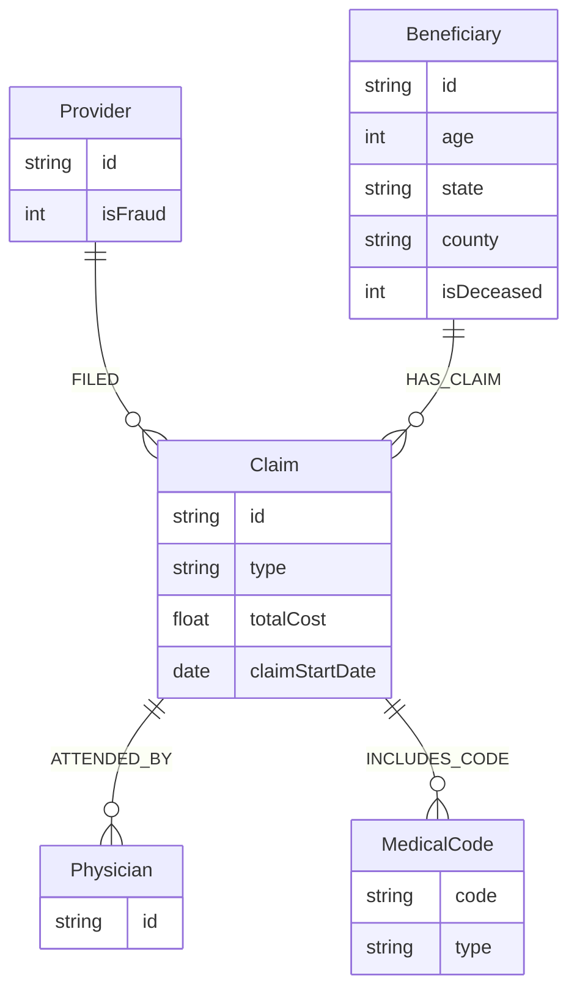

# Graph Model Diagrams

This document provides visual descriptions and ASCII diagrams of the healthcare fraud detection graph model.

## Node Type Diagram

```
┌─────────────────────────────────────────────────────────────┐
│                        NODE TYPES                            │
└─────────────────────────────────────────────────────────────┘

┌──────────────┐
│   Provider   │
├──────────────┤
│ id: string   │
│ isFraud: int │
└──────────────┘
      │
      │ FILED
      ▼
┌──────────────┐
│    Claim     │
├──────────────┤
│ id: string   │
│ type: string │
│ totalCost:   │
│   float      │
│ dates...     │
└──────────────┘
      │
      │ HAS_CLAIM
      ▼
┌──────────────┐
│ Beneficiary  │
├──────────────┤
│ id: string   │
│ age: int     │
│ state: str   │
│ county: str  │
│ gender: str  │
│ race: int    │
│ isDeceased: │
│   int        │
│ chronic      │
│   conditions │
└──────────────┘

┌──────────────┐
│  Physician   │
├──────────────┤
│ id: string   │
└──────────────┘
      ▲
      │ ATTENDED_BY
      │
┌──────────────┐
│    Claim     │
└──────────────┘
      │
      │ INCLUDES_CODE
      ▼
┌──────────────┐
│ MedicalCode  │
├──────────────┤
│ code: string │
│ type: string │
└──────────────┘
```

## Complete Graph Schema Diagram

```
                    ┌──────────────┐
                    │   Provider   │
                    │  (id, isFraud)│
                    └──────┬───────┘
                           │
                           │ FILED
                           │
                    ┌──────▼───────┐
                    │    Claim     │
                    │ (id, type,  │
                    │  totalCost, │
                    │  dates...)  │
                    └──┬───────┬──┘
                       │       │
        HAS_CLAIM      │       │ ATTENDED_BY
                       │       │ (type)
                       │       │
        ┌──────────────┘       └──────────────┐
        │                                    │
        │                                    │
┌───────▼──────┐                    ┌───────▼──────┐
│ Beneficiary  │                    │  Physician  │
│ (id, age,    │                    │    (id)     │
│  state,      │                    └─────────────┘
│  county,     │
│  gender,     │
│  race,       │
│  isDeceased, │
│  chronic     │
│  conditions) │
└──────────────┘
        │
        │
        │
┌───────▼──────┐
│    Claim     │
└───────┬──────┘
        │
        │ INCLUDES_CODE
        │
┌───────▼──────┐
│ MedicalCode  │
│ (code, type) │
└──────────────┘
```

## Relationship Type Diagram

```
┌─────────────────────────────────────────────────────────────┐
│                    RELATIONSHIP TYPES                       │
└─────────────────────────────────────────────────────────────┘

1. FILED
   Provider ──────[FILED]──────> Claim
   Direction: Provider → Claim
   Properties: None
   Purpose: Indicates which provider filed a claim

2. HAS_CLAIM
   Beneficiary ───[HAS_CLAIM]───> Claim
   Direction: Beneficiary → Claim
   Properties: None
   Purpose: Links beneficiaries to their claims

3. ATTENDED_BY
   Claim ──────[ATTENDED_BY]───> Physician
   Direction: Claim → Physician
   Properties: type (Attending, Operating, Other)
   Purpose: Links claims to attending physicians

4. INCLUDES_CODE
   Claim ─────[INCLUDES_CODE]───> MedicalCode
   Direction: Claim → MedicalCode
   Properties: None
   Purpose: Links claims to diagnosis/procedure codes
```

## ER-Style Graph Schema

```
┌─────────────────────────────────────────────────────────────┐
│              COMPLETE GRAPH SCHEMA                           │
└─────────────────────────────────────────────────────────────┘

                    PROVIDER
                    ┌─────────────┐
                    │ id (PK)     │
                    │ isFraud     │
                    └──────┬──────┘
                           │
                           │ FILED (1:N)
                           │
                    ┌──────▼──────┐
                    │    CLAIM    │
                    │ id (PK)     │
                    │ type        │
                    │ totalCost   │
                    │ dates...    │
                    └──┬───────┬──┘
                       │       │
        HAS_CLAIM      │       │ ATTENDED_BY (N:M)
        (N:1)          │       │ type
                       │       │
        ┌──────────────┘       └──────────────┐
        │                                    │
        │                                    │
┌───────▼──────┐                    ┌───────▼──────┐
│ BENEFICIARY  │                    │  PHYSICIAN   │
│ id (PK)      │                    │ id (PK)      │
│ age          │                    └──────────────┘
│ state        │
│ county       │
│ gender       │
│ race         │
│ isDeceased   │
│ chronic      │
│   conditions │
└──────────────┘
        │
        │
        │
┌───────▼──────┐
│    CLAIM     │
└───────┬──────┘
        │
        │ INCLUDES_CODE (N:M)
        │
┌───────▼──────┐
│ MEDICALCODE  │
│ code (PK)    │
│ type         │
└──────────────┘

Cardinality:
- Provider → Claim: 1:N (one provider files many claims)
- Beneficiary → Claim: 1:N (one beneficiary has many claims)
- Claim → Physician: N:M (many claims, many physicians)
- Claim → MedicalCode: N:M (many claims, many codes)
```

## Node Properties Detail

### Provider Node
```
┌─────────────────┐
│    Provider     │
├─────────────────┤
│ Properties:     │
│ • id: string    │  (Unique identifier)
│ • isFraud: int  │  (1 = fraud, 0 = legitimate)
└─────────────────┘
```

### Beneficiary Node
```
┌──────────────────────────────────┐
│         Beneficiary               │
├──────────────────────────────────┤
│ Properties:                      │
│ • id: string                     │  (Unique identifier)
│ • age: int                       │  (Calculated from DOB)
│ • State: string                  │  (State of residence)
│ • County: string                 │  (County of residence)
│ • Gender: string                 │  (0/1/2)
│ • Race: int                      │  (Race code)
│ • isDeceased: int                │  (1 = deceased, 0 = alive)
│ • ChronicCond_Alzheimer: int     │  (0/1)
│ • ChronicCond_Heartfailure: int   │  (0/1)
│ • ChronicCond_KidneyDisease: int │  (0/1)
│ • ChronicCond_Cancer: int        │  (0/1)
│ • ChronicCond_ObstrPulmonary: int│  (0/1)
│ • ChronicCond_Depression: int    │  (0/1)
│ • ChronicCond_Diabetes: int     │  (0/1)
│ • ChronicCond_IschemicHeart: int│  (0/1)
│ • ChronicCond_Osteoporasis: int │  (0/1)
│ • ChronicCond_rheumatoidarthritis│  (0/1)
│ • ChronicCond_stroke: int       │  (0/1)
│ • RenalDiseaseIndicator: string │  (Y/N)
└──────────────────────────────────┘
```

### Claim Node
```
┌─────────────────────────────┐
│          Claim              │
├─────────────────────────────┤
│ Properties:                 │
│ • id: string                │  (Unique identifier)
│ • type: string             │  ("Inpatient" or "Outpatient")
│ • totalCost: float         │  (reimbursed + deductible)
│ • claimStartDate: date     │
│ • claimEndDate: date       │
│ • admissionDate: date      │  (inpatient only)
│ • dischargeDate: date      │  (inpatient only)
│ • reimbursedAmount: float  │
│ • deductibleAmount: float  │
└─────────────────────────────┘
```

### Physician Node
```
┌──────────────┐
│  Physician   │
├──────────────┤
│ Properties:  │
│ • id: string │  (Unique identifier)
└──────────────┘
```

### MedicalCode Node
```
┌──────────────┐
│ MedicalCode  │
├──────────────┤
│ Properties:  │
│ • code: str  │  (Medical code)
│ • type: str  │  ("Diagnosis" or "Procedure")
└──────────────┘
```

## Relationship Properties Detail

### ATTENDED_BY Relationship
```
Claim ──────[ATTENDED_BY {type: "Attending"}]──────> Physician
Claim ──────[ATTENDED_BY {type: "Operating"}]──────> Physician
Claim ──────[ATTENDED_BY {type: "Other"}]───────────> Physician

Properties:
• type: string  (Attending, Operating, or Other)
```

### Other Relationships
```
FILED: Provider ──────[FILED]──────> Claim
       (No properties)

HAS_CLAIM: Beneficiary ───[HAS_CLAIM]───> Claim
           (No properties)

INCLUDES_CODE: Claim ───[INCLUDES_CODE]───> MedicalCode
                (No properties)
```

## Visual Representation for Word Document

For the Word document submission, create professional diagrams using:

1. **draw.io** (https://app.diagrams.net/)
   - Free, web-based
   - Professional diagrams
   - Export as PNG/SVG

2. **Lucidchart** (https://www.lucidchart.com/)
   - Professional diagramming
   - ER diagram templates
   - Export options

3. **Neo4j Browser**
   - Visualize actual graph
   - Export as image
   - Shows real data

4. **Mermaid** (for markdown)
   - Code-based diagrams
   - Can be embedded in documents

### Example Mermaid Diagram



---

## Summary

The graph model consists of:
- **5 Node Types**: Provider, Beneficiary, Claim, Physician, MedicalCode
- **4 Relationship Types**: FILED, HAS_CLAIM, ATTENDED_BY, INCLUDES_CODE
- **Properties**: Nodes and relationships have relevant properties
- **Cardinality**: 1:N and N:M relationships as shown

This model enables efficient fraud detection through relationship traversal and pattern matching.

